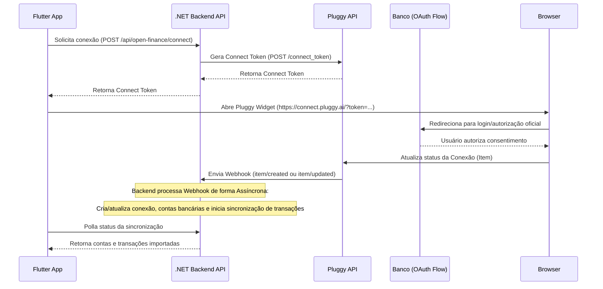

# Integração Open Finance Brasil (Fafnir Vault)

Esta documentação descreve a arquitetura, o fluxo de integração e as configurações necessárias para a integração do Fafnir Vault com o **Open Finance Brasil** utilizando o agregador **Pluggy**.

---

## 1. Visão Geral da Arquitetura

A integração utiliza o fluxo oficial do Open Finance para consentimento de compartilhamento de dados sem capturar credenciais bancárias dos usuários.



---

## 2. Modelagem do Banco de Dados

Foram criadas três tabelas principais no PostgreSQL para mapear as conexões, contas e transações:

1. **`OpenFinanceConexoes` (`open_finance_conexoes`)**:
   - Representa um `Item` da Pluggy (a instituição financeira conectada).
   - Armazena `Status` (ex: `UPDATED`, `LOGIN_ERROR`, `OUTDATED`) e metadados da instituição.
2. **`ContasBancarias` (`contas_bancarias`)**:
   - Armazena as contas associadas a uma conexão (ex: Conta Corrente, Poupança, Cartão de Crédito).
   - Guarda `SaldoAtual`, `Moeda` e `UltimaSincronizacao`.
3. **`TransacoesBancarias` (`transacoes_bancarias`)**:
   - Guarda o histórico de transações importado da Pluggy.
   - Contém um índice único composto `(Provedor, ProvedorTransacaoId, FkIdContaBancaria)` para prevenção de duplicidade (idempotência).

---

## 3. Autenticação e Segurança

Para proteger os dados dos usuários, todas as requisições de Open Finance validam os tokens Bearer enviados pelo app:
- O token é decodificado e verificado usando a assinatura HMAC-SHA256 e o segredo `Auth:TokenSecret` configurado no `appsettings.json`.
- O payload decodificado é validado contra expiração (`exp`) e o ID do usuário (`sub`) é extraído de forma segura para garantir que ele só acesse suas próprias contas bancárias.
- O endpoint de webhook `/api/open-finance/webhook` é exposto de forma pública para permitir que a Pluggy notifique o backend sobre novos dados ou atualizações de consentimento.

---

## 4. Classificação Automática de Transações

O backend categoriza as transações importadas localmente utilizando regras baseadas em padrões textuais da descrição da transação.
- **Exemplos de correspondências:**
  - `iFood`, `Rappi`, `Burguer King`, `McDonald` $\rightarrow$ **Alimentação**
  - `Uber`, `99Taxis`, `Cabify`, `Metro`, `Posto` $\rightarrow$ **Transporte**
  - `Netflix`, `Spotify`, `Steam`, `Cinema` $\rightarrow$ **Entretenimento**
  - `Supermercado`, `Carrefour`, `Assai`, `Mercado` $\rightarrow$ **Mercado**

As transações que não se enquadram em nenhuma regra permanecem sem categoria inicial para que o usuário as defina manualmente na interface do aplicativo.

---

## 5. Configuração no Backend (`appsettings.json`)

Adicione a seção `OpenFinance` com as suas credenciais obtidas no Dashboard da Pluggy:

```json
{
  "OpenFinance": {
    "ClientId": "SEU_CLIENT_ID_PLUGGY",
    "ClientSecret": "SEU_CLIENT_SECRET_PLUGGY",
    "WebhookUrl": "https://sua-api.com/api/open-finance/webhook",
    "RedirectUri": "fafnirvault://open-finance/callback"
  }
}
```

*Nota: Em ambiente local, você pode utilizar uma ferramenta como o **ngrok** para expor a porta da sua API localmente e configurar o webhook correspondente no painel da Pluggy.*

---

## 6. Fluxo de Uso do Usuário

1. O usuário navega até a tela de **Perfil** no app Flutter.
2. Na seção **Open Finance Brasil**, clica em **Conectar**.
3. O app obtém o token de conexão do backend e abre o Pluggy Widget no navegador seguro do sistema.
4. O usuário escolhe um banco (ex: *Banco do Brasil Sandbox*) e entra com as credenciais de teste para simular a autorização.
5. Após o fluxo ser concluído, o usuário retorna ao app. O backend recebe o webhook do Pluggy em segundo plano, importa as contas e inicia a importação de transações em segundo plano.
6. A tela do app sincroniza os saldos e as transações de forma dinâmica.
